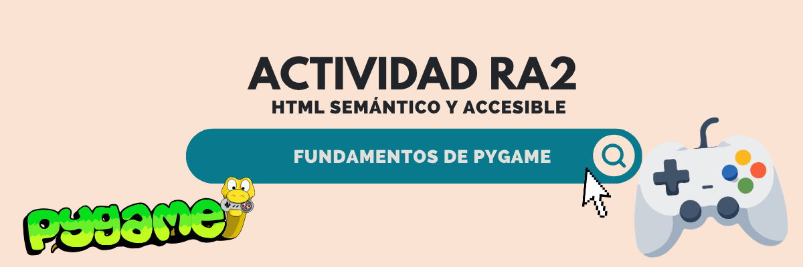

# Actividad 2.  Implementación de una página HTML5 básica, siguiendo buenas prácticas de semántica y accesibilidad

<p align="center">
  
</p>

## Tema de la página web
Un artículo acerca de los conceptos básicos del desarrollo de juegos 2D con la librería de Pygame, con ejemplos o snippets de código.

# Actividad RA2 - HTML Semántico y Accesible: Guía de Pygame

Este repositorio contiene el código fuente y los recursos para la actividad de diseño web centrada en el uso de **HTML5 semántico** y **buenas prácticas de accesibilidad web**. La página web desarrollada es una guía didáctica y completa sobre el desarrollo de videojuegos 2D utilizando la librería **Pygame** en Python.

## Propósito de la Página Web
El objetivo de este proyecto es servir como un recurso para personas interesadas en aprender los fundamentos de Pygame. La página recopila conceptos esenciales desde la instalación del entorno y la creación de un ciclo de juego básico (*game loop*) hasta el manejo de eventos, gráficos, colisiones y reproducción de audio, finalizando con un ejemplo práctico.

## Cómo se aplicó la Semántica HTML5
Para asegurar una correcta jerarquía y organización lógica del contenido, se utilizaron diversas etiquetas semánticas de HTML5:
* `<header>`: Contiene la barra de navegación principal fija en la parte superior (`sticky-top`).
* `<nav>`: Empleado tanto para la barra de navegación principal como para el índice interno de contenidos (`<aside>`), diferenciándolos mediante atributos `aria-label`.
* `<main>`: Envuelve el contenido central y principal de la página.
* `<article>`: Agrupa el cuerpo completo de la guía y su contenido independiente.
* `<section>`: Utilizado para dividir cada uno de los temas tratados (Introducción, Estructura básica, Ciclo de juego, Dibujar elementos, etc.), cada uno con su respectivo título identificatorio (`<h2>`).
* `<aside>`: Aloja el índice lateral de navegación interna para facilitar el salto rápido entre secciones.
* `<footer>`: Contiene información de autoría, derechos de autor y enlaces de interés al repositorio.
* `<figure>` y `<figcaption>`: Utilizados para asociar semánticamente las imágenes, banners y bloques de código con sus respectivas descripciones.

## Criterios de Accesibilidad Aplicados
El desarrollo priorizó el cumplimiento riguroso de las pautas de accesibilidad web (WCAG):
* **Atributos `alt` descriptivos:** Todas las imágenes incorporan descripciones textuales alternativas. Las imágenes decorativas o iconos vectoriales utilizan `aria-hidden="true"` para evitar que los lectores de pantalla anuncien información redundante o ruido.
* **Atributos ARIA:** Se implementaron atributos como `aria-label` en enlaces y botones ambiguos (por ejemplo, los botones de menú desplegable y accesos a perfiles externos) y `aria-controls` / `aria-expanded` para la gestión accesible del menú móvil de Bootstrap.
* **Navegación por teclado:** Se mantuvo el orden natural del DOM y los elementos interactivos nativos (enlaces y botones) para asegurar una navegación fluida exclusivamente mediante teclado.
* **Seguridad en enlaces externos:** Todos los enlaces externos cuentan con las etiquetas `target="_blank"` y `rel="noopener noreferrer"`.
* **Contraste y diseño adaptativo:** Se utilizaron hojas de estilo basadas en Bootstrap y esquemas de colores oscuros optimizados (como Prism para bloques de código) para una correcta lectura visual.

## Estructura del Proyecto
```text
/
├── index.html        
├── style.css        
├── README.md         
└── assets/           # Carpeta de recursos gráficos
    ├── Banner.png    
    ├── css.svg    
    └── Gif_AbyssBound.gif 
